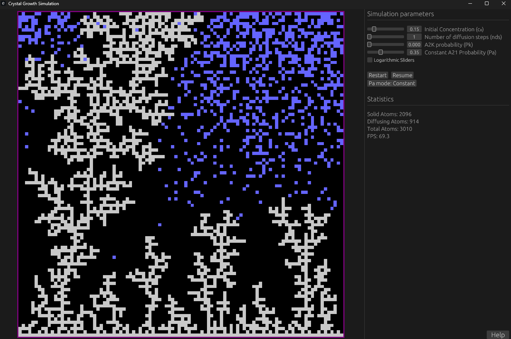
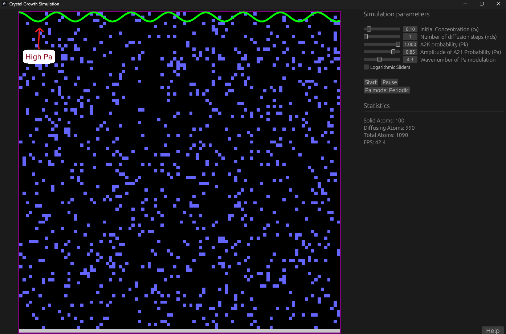

# Crystal Life 2D

This is a simplified implementation of the CA+MC model of crystal growth in 2D. The code is written in Rust and provides
and interactive GUI that allows for real-time change of model parameters.

The main purpose is to provide a model that allows for quick exploration of how different parameters affect growth conditions
and the resulting morphology.

## Parameters

The main parameters of the model are:
1. $c_0$ - the initial concentration of the diffusing particles
2. $nds$ - the number of diffusional steps
3. $P_a$ - the probability of attachment of diffusing particle to one neighbour in the crystal state
4. $P_k$ - the probability of attachment to kink position

## Modes

The model provides two modes of operation for $P_a$:
1. "Constant $P_a$" - the probability of attachment to one is constant and does not change along the grid axes
2. "Periodic $P_a$" - the probability of attachment to one changes periodically along the grid rows, modulated by the amplitude and wavenumber

In periodic mode a green line is drawn to indicate the variation of $P_a$ along the grid rows.

## Compilation 

The code is written in Rust and uses the egui library for the GUI. It is fully cross-platform and can be compiled for 
all standart platforms. 

To compile:

1. Install Rust from the official website: https://rust-lang.org/tools/install/
2. Clone this repostiory: `git clone https://github.com/vasilvas99/crystal-step-life-2d.git`
3. Navigate to the project directory: `cd crystal-step-life-2d`
4. Build the project: `cargo build --release`
5. Run the executable: `cargo run --release`

## Downloads

You can also download precompiled binaries for Windows, Linux and MacOS from the releases page:
https://github.com/vasilvas99/crystal-step-life-2d/releases